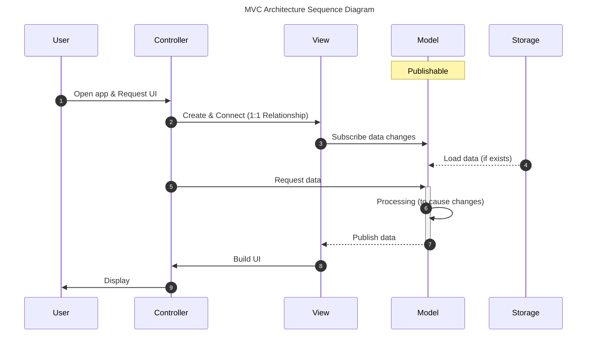
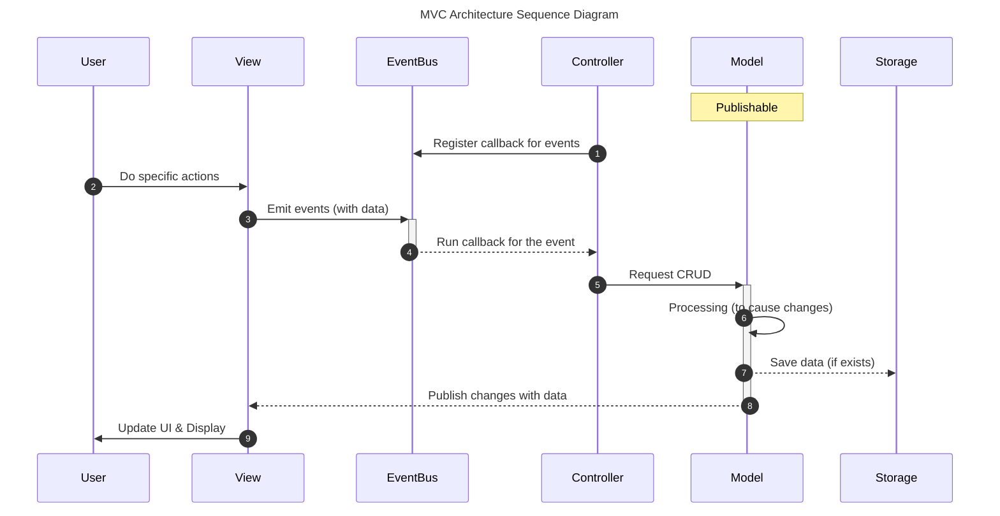

2023년 8월 22일부터 9월 1일까지 UIKit 숙련 과정 개인 과제를 진행했습니다.

UIKit의 몇 가지 심화 내용을 학습하고 저번에 작성했던 입문 과제에서 작성했던 To-Do App을 개선하는 과제였습니다.

이번 프로젝트의 목표는 아래와 같습니다.

- URLSession을 활용하여 네트워크 통신으로 데이터를 불러옵니다.
- MVC 아키텍처를 이해하고 적용합니다.
- iOS 앱과 UIViewController의 Lifecycle을 이해합니다.
- UserDefaults를 활용하여 데이터를 저장하고 불러옵니다.
- Dependency, 라이브러리, 프레임워크, 모듈에 대해 이해합니다.
- SPM을 사용하여 프로젝트의 의존성 관리를 할 수 있습니다.

특히나, MVC 아키텍처를 적용하며 많은 고민을 해봤습니다. 어떻게 하면 각 역할에 맞게 코드를 잘 분리하고 데이터나 이벤트 흐름을 관리할 수 있을지 고민하면서 작성했습니다.

**결과 미리보기**






---

## 프로젝트 구조

```plaintext
ToDoList/
├── Resources/
├── Models/
├── ViewModels/
├── Services/
├── Views/
│  ├── EditTaskGroup/
│  ├── Shared/
│  ├── TaskGroup/
│  ├── TaskTable/
│  ├── Identifier.swift
│  └── RootView.swift
├── Controllers/
├── Utilities/
└── Info.plist
```

## 프로젝트 구현

### 제공하는 기능

- 할 일 그룹 생성/변경/삭제
- 할 일 생성/변경/삭제
- 할 일 순서 변경
- 할 일 그룹 진행률 표시 (원형 진행바, 애니메이션 적용)
- 할 일 그룹 별 랜덤 이미지 설정 (The Dog/Cat API)
- 할 일 그룹 별 색상 설정
- CollectionView / TableView 제공
- Color Theme 대응 (Light/Dark)

### MVC Architecture

해당 프로젝트는 Model - View - Controller 패턴을 적용하여 구현했습니다.

#### Model

- 자료구조 및 클래스를 가지고 있는 Model과 ViewModel, 그리고 비즈니스 로직을 가진 Service입니다.
- Models: `Codable` 프로토콜을 채택한 자료구조를 가집니다. Storage에서 데이터를 불러오고 내보내기 위해 사용합니다.
- ViewModels: Model의 데이터를 가공하여 View에게 전달합니다.
  - [`Publishable`](#publishable)을 적용하여 구독자에게 변경사항을 알립니다.
- Services: 비즈니스 로직을 담당합니다.
  - APIService: 네트워크 관련 로직을 담당합니다.
  - TaskService:   `ViewModels` 데이터를 관리합니다.

#### View

- View는 사용자에게 보여지는 UI를 구성합니다.
- `RootView`
  - Controller와 1:1 관계로 연결되는 View입니다. `TypedViewController`에게 전달됩니다.
  - 프로토콜로서 `initializeUI()`를 필수로 구현해야 합니다.
- 그 외 View는 `RootView`에서 사용하는 하위 View입니다.
- Model의 변경사항을 구독하고 있으며, 구독 중인 속성이 변경되면 UI를 변경합니다. ([`Publishable`](#publishable))
- 특정 이벤트가 발생하면 Controller에게 이를 알립니다. ([`EventBus`](#eventbus))

#### Controller

- Controller는 View를 생성하고 연결합니다. 연결된 View는 `typedView` 속성을 통해 접근할 수 있습니다.
- [`EventBus`](#eventbus)에 View에서 발생하는 모든 이벤트를 등록합니다. (`ViewControllerEvents`, `RootViewController`)
- 등록된 이벤트가 발생했을 때 Model에게 데이터 변경을 요청할 수 있습니다.

### Scenarios

#### 사용자가 앱을 접속했을 때



1. User가 앱을 실행하고 UI를 요청하면, 
   1. Controller가 View를 생성하고 자신에게 연결합니다. (`TypedViewController`)
   2. View를 생성하는 단계에서 Model의 변경사항을 구독합니다. ([Publishable](#publishable))
   3. Storage로부터 데이터를 불러와 Model을 준비합니다.
2. Controller는 UI를 그리기 위해 필요한 데이터를 Model에 요청합니다.
3. Model은 필요한 데이터를 정리하여 View에게 발행합니다. View는 이를 토대로 UI를 구축합니다.
4. View와 연결된 Controller를 통해서 사용자에게 UI를 보여줍니다.

#### 사용자가 UI를 조작했을 때



1. Controller가 생성되는 과정에서 특정 이벤트에 실행할 동작을 정의합니다. ([EventBus](#eventbus))
2. User가 View를 통해 특정 행동을 수행하면 EventBus에 등록된 이벤트를 발행합니다.
3. 해당 이벤트를 구독 중인 Controller는 이벤트를 받아 데이터 생성/변경/삭제를 Model에게 요청합니다.
4. Model은 요청에 맞게 데이터를 적절히 처리한 후, 변환하여 Storage에 저장합니다.
5. Model은 변경사항을 데이터와 함께 구독 중인 View에게 알립니다. View는 이를 토대로 UI를 변경합니다.
6. View와 연결된 Controller를 통해서 사용자에게 UI를 보여줍니다.

## API References

### Publishable

속성값의 변경사항을 구독자에게 자동으로 알려주는 Property Wrapper 클래스입니다.

>내부적으로 `self`에 대한 참조를 [`WeakRef`](#weakref)로 관리하고 있으므로, 메모리 해제 시 자동으로 구독을 해제합니다.

**API**

- `Publishable`: 값의 변화를 구독자에게 알려주는 Property Wrapper 클래스입니다.
- `Publisher`: 발행자를 나타냅니다. `Publishable`을 적용한 속성의 타입입니다.
- `Subscriber`: 구독자를 나타냅니다. `Publishable`을 구독하는 타입입니다.
- `Changes`: 값의 변화를 나타냅니다. 변경이전 값 `old`와 변경된 값 `new`를 가집니다.

```swift
/// 구독자를 추가합니다. (immediate을 true로 설정하면 구독 즉시 이벤트를 발행합니다)
/// 이미 구독 중인 경우, 기존 구독을 취소하고 새로운 구독을 추가합니다.
func subscribe<Subscriber>(by: Subscriber, immediate: Bool, EventCallback<Subscriber>)

/// 주어진 구독자의 구독을 취소합니다.
func unsubscribe<Subscriber>(by: Subscriber)

/// 구독자에게 변경 사항을 발행합니다. nil을 전달하면 현재 값으로 발행합니다.
func publish(Changes?)
```

**Example**

```swift
final class MyModel {
    @Publishable var name: String

    init(name: String) {
        self.name = name
    }
}

final class Main {
    static let shared = Main()
    private init() {}

    func run() {
        let model = MyModel(name: "Old Model")

        model.$name.subscribe(by: self, immediate: true) { (subscriber, changes) in
            // 강한 순환 참조를 피하기 위해 self 대신 subscriber를 사용합니다.
            print("Old Name: \(changes.old), New Name: \(changes.new)")
        }
        
        model.name = "New Model"  // 구독자에게 변경을 알립니다.
    }
}

Main.shared.run()

// 출력 결과
// Old Name: Old Model, New Name: Old Model
// Old Name: Old Model, New Name: New Model
```

### EventBus

이벤트를 관리하며, 구독 및 발행 기능을 제공합니다. 이벤트 기반의 프로그래밍 패턴을 제공합니다.

>내부적으로 `self`에 대한 참조를 [`WeakRef`](#weakref)로 관리하고 있으므로, 메모리 해제 시 자동으로 구독을 해제합니다.

**API**

- `EventBus`: 이벤트를 구독 및 발행할 수 있는 싱글턴 클래스입니다.
- `EventProtocol`: 이벤트를 나타내는 프로토콜입니다. `Payload` 연관 타입을 가집니다.
- `Emitter`: 이벤트를 발행할 수 있는 타입입니다.
- `Listener`: 이벤트를 구독할 수 있는 타입입니다.

```swift
/// 주어진 이벤트를 구독합니다.
func on<Listener, Event: EventProtocol>(Event.Type, by: Listener, EventCallback<Listener, Event>) 

/// 주어진 구독자의 이벤트 구독을 취소합니다.
func off<Listener, Event: EventProtocol>(Event, by: Listener) 

/// 주어진 구독자의 모든 구독을 취소합니다.
func reset<Listener>(Listener)

/// 주어진 이벤트를 발행합니다.
func emit<Event: EventProtocol>(Event) 
```

**Example**

```swift
final class Main {
    static let shared = Main()
    private init() {}
    
    func run() {
        struct MyEvent: EventProtocol {
            struct Payload {
                let text: String
            }

            let payload: Payload
        }

        // 이벤트 구독
        EventBus.shared.on(MyEvent.self, by: self) { (listener, payload) in
            // 강한 순환 참조를 피하기 위해 self 대신 listener를 사용합니다.
            print("Payload: \(payload.text)")
        }

        // 이벤트 발행
        EventBus.shared.emit(MyEvent(payload: .init(text: "Hello, World!")))
    }
}

Main.shared.run()

// 출력 결과
// Payload: Hello, World!
```

### WeakRef

`weak` 참조를 감싸는 구조체입니다.

```swift
struct WeakRef<T: AnyObject> {
    weak var value: T?
    init(_ value: T?) {
        self.value = value
    }
}
```

### Storage

데이터를 (영속적으로) 저장하고, 불러오는 기능을 제공하는 타입이 채택하는 프로토콜입니다.

현재 `UserDefaultsStorage`를 제공합니다.

```swift
protocol Storage {
    static var shared: Self { get }

    func save<T: Encodable>(_ object: T, forKey key: String)
    func load<T: Decodable>(forKey key: String) -> T?
    func remove(forKey key: String)
}
```

---

## 회고

이번 개인 과제를 진행하면서 MVC 아키텍처에 대해 많은 경험을 해볼 수 있었습니다. UIKit에서 View와 Controller를 어떻게 분리할 수 있을지, 그리고 View에서 사용자 입력이 발생했을 때 Controller에게 어떻게 알려줄 수 있을지, 그리고 Model에서 데이터가 변경되었을 때 View에게 어떻게 알려줄 수 있을지 고민하면서 여러 시도를 해보았습니다. 이러한 문제를 해결하기 위해 `TypedViewController`, `EventBus` 그리고 `Publishable`을 구현하고 프로젝트에 적용해보았는데요. 확실히 디자인 패턴이 문제를 해결하는데 도움을 주고 또 꽤 효율적이라고 느낄 수 있었습니다.

아쉬운 점은 튜터님께서 피드백을 주신대로 `EventBus`의 이벤트가 너무 몰려있다는 점이었습니다. 다음 팀 프로젝트에서는 이러한 문제를 개선하고 보다 더 나은 MVC 아키텍처를 적용해보려고 합니다.
